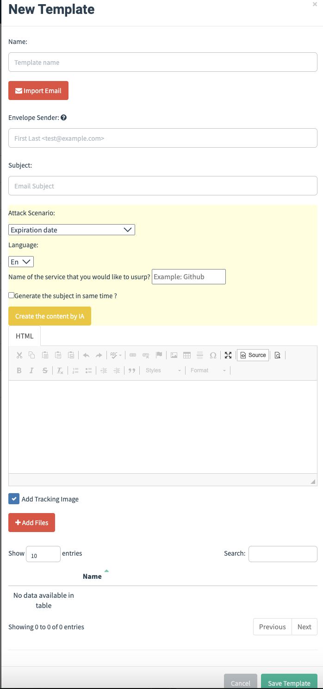

# OpenSearch

OpenSearch is a family of software consisting of a search engine, and OpenSearch Dashboards, a data visualization dashboard for that search engine.

## View your campaign dashboard

To view your campaign dashboard, you must go to the “Reporting” tab.

<figure><figcaption></figcaption></figure>

Then you need to click on “Log in with single sign-on”.

<figure><figcaption></figcaption></figure>

Then you will arrive on the Keycloack connection page, you will need to log in with your connection details.

<figure><figcaption></figcaption></figure>

Then you have to go to Gottaphish reporting.

<figure><figcaption></figcaption></figure>

Then on "discover".&#x20;

<figure><figcaption></figcaption></figure>

Then on "Campagne all".&#x20;

<figure><figcaption></figcaption></figure>

You will arrive on a dashboard like this below. You can view the different OS, the percentage of emails opened, the percentage of data transmitted and the percentage of clicks.

<figure><figcaption></figcaption></figure>

At the top left in filtered then in "edit as Query DSL" you can filter for example all campaigns using "Campaign".

<figure><figcaption></figcaption></figure>

```
{
  "query": {
    "wildcard": {
      "campaign_name.keyword": {
        "value": "Campagne*"
      }
    }
  }
}
```
