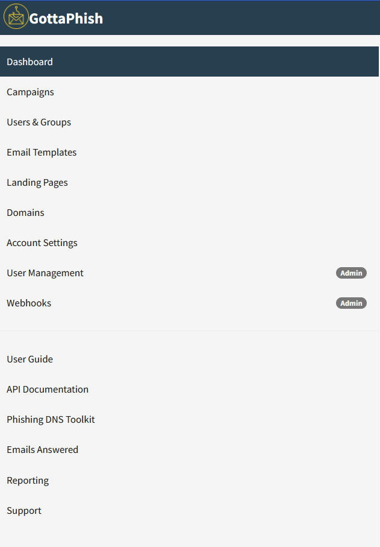

# Templates

A "Template" is the content of the emails that are sent to targets. They can be imported from an existing email, or created from scratch. They also support sending attachments.

Additionally, templates can contain tracking images so that gophish knows when the user opens the email.

## Creating Templates

To create a template, first navigate to the “Email Templates” page and click the “New Template” button.

### Using the HTML Editor

A powerful feature of Gophish is the HTML editor. To switch between the HTML source code and the visual view, click the "Source" button.

This is helpful to ensure that the email received by the user is pixel-perfect.

### Using the IA generation

With the IA section you can generate automatically an email for the company/website that you want. You just need to fill the name or the website of the company , to choose a phishing scenario, to click on <> Source and "Create the content by IA"  and a automatic email will be designed just for you. Don't hesitate to click on <> Source again after to visually see the email&#x20;

### Importing an Email

Gophish supports the ability to import an email from the raw content. To do this, click the "Import Email" button and paste in the original email content. This content is usually found through the "View Original" feature of many mail clients:

